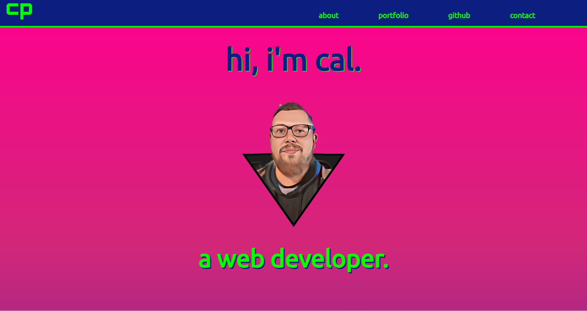
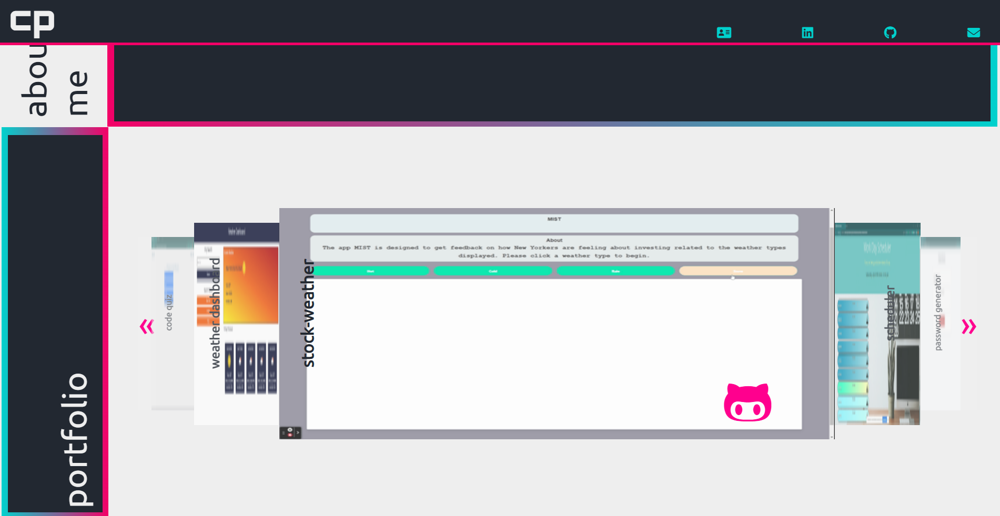

# Code Portfolio v2


## Goal
Create version 2 of my portfolio.  The updated version contains additional links showcasing my resume, providing my email address and twitter handle and introduce javascript to cycle through my projects.  


## Acceptance Criteria

```
Your updated portfolio should:

1. Display your contact information. If you don't want to share your personal email or phone number, use a separate email that you will only use for coding, also known as a developer email, and/or a call forwarding service, such as [Google Voice](https://voice.google.com/).

2. Have links to your GitHub profile and LinkedIn profile

3. Have a link to a downloadable PDF of your resume

4. Display at least 2 examples of student work from either deployed projects or homeworks. For each project, make sure you have the following:

	* Project title

	* Link to the deployed version

	* Link to the GitHub repository

	* Screenshot of the deployed application

5. Have a polished, mobile-responsive user interface.

Your GitHub profile must contain at least the following items:

1. Profile picture or avatar

  * A photo or an avatar other than the default Github identicon. (a semi-professional to professional photo or an avatar photo are preferred)

2. Biography

3. Email address. If you don't want to share your personal email or phone number, use a developer email.

4. Link to your deployed portfolio

5. At least 2 pinned repositories:

	* Navigate to [GitHub](https://github.com/) and go to your profile.

	* Click "Customize your pins"

	* Click the checkboxes for your project and 2-3 homework assignments that you would like to share

6. Follow a few of your classmates and/or other developers. They are the beginning of your professional network and being a developer is as much about being a part of the community as it is writing code.

Updated Resume 

Submit a clear, concise, and compelling resume, tailored to the type of job you’re looking for.

Your resume should include:

* a heading with your name, phone number, professional email address, links to LinkedIn, portfolio and GitHub. If you don't want to share your personal email or phone number, use a separate email that you will only use for coding, also known as a developer email, and/or a call forwarding service, such as [Google Voice](https://voice.google.com/).

* a technical skills section, with all programming languages and technologies listed

* 3 of your strongest projects/homework assignments with brief description, languages used, and URL

Updated LinkedIn


Update your LinkedIn Profile with a strong bio statement, a professional photo, and links to your Github and portfolio.

```

## Originial Portfolio
[My Code Portfolio](http://cpaschall.github.io/code-portfolio)



## Updated Portfolio

[Code Portfolio version 2](http://cpaschall.github.io/code-portfolio-v2)


